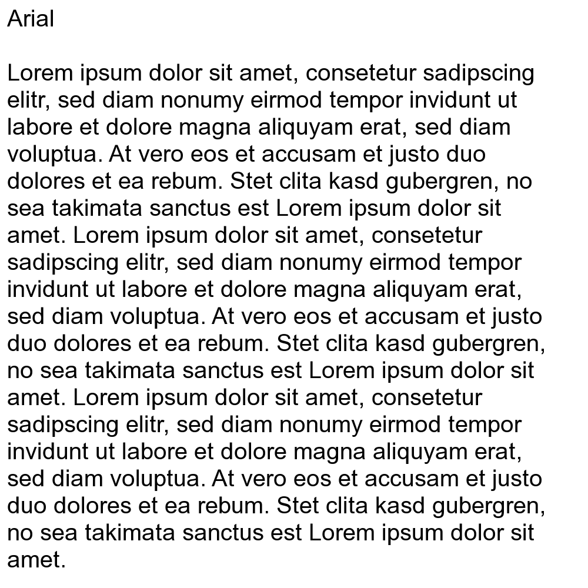
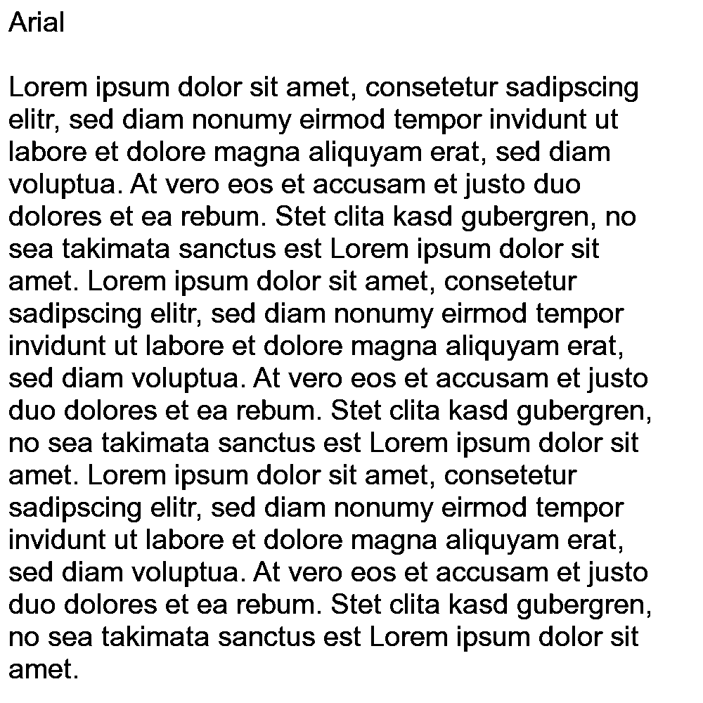

# img2bmp-proxy

Creates monochrome bitmaps from graphical image files (such as JPEG, PNG, etc.) hosted on public URLs using image thresholding. This proxy can be used to prepare images for e-paper displays.

## Usage

```bash
curl http://localhost:8080/?width=1024&height=469&threshold=200&url=https://upload.wikimedia.org/wikipedia/commons/thumb/1/11/Test-Logo.svg/2560px-Test-Logo.svg.png
```

| URL Parameter | Description                                                                                                                      |
| ------------- | -------------------------------------------------------------------------------------------------------------------------------- |
| `width`       | Width to resize the image to                                                                                                     |
| `height`      | Height to resize the image to                                                                                                    |
| `threshold`   | Pixel threshold value<br>If the pixel value is smaller than the threshold, it's set to 0, otherwise it's set to a maximum value. |
| `url`         | Image URL                                                                                                                        |

## Samples

### PNG (1000x1000)



### BMP (1000x1000)



### BMP (500x500)


## Requirements

- Python 3.12
